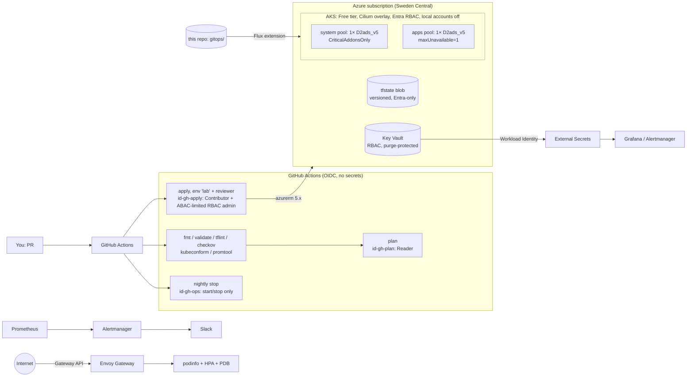

# aks-platform-lab

A production-shaped AKS platform built to run for **30 days on €100 of Azure free-trial credit**:
Terraform for Azure, Flux for everything inside the cluster, Prometheus/Grafana/Alertmanager for
SLO-based alerting, and a set of failure drills that each produce a real incident story.

Planned spend: **about €52**. The other ~€48 covers mistakes.



## What's here

| Path | What it does |
|---|---|
| `infra/bootstrap` | One-time, run as Owner: state account (Entra-only, versioned, locked), workload RG, 3 GitHub OIDC identities with least privilege, resource providers, **budget alerts**. Moves its own state into the account it creates. |
| `infra/modules/network` | VNet, node subnet (no default outbound access), NSG for Gateway ingress. |
| `infra/modules/aks` | AKS Free tier, Azure CNI Overlay + Cilium, Entra ID + Azure RBAC, local accounts disabled, authorized IP ranges, workload identity, ephemeral OS disks, encryption at host, AzureLinux, patch auto-upgrade in **daytime** maintenance windows, quota-aware upgrade settings. |
| `infra/modules/platform-secrets` | Key Vault (RBAC, purge protection), ESO identity with a federated credential, secrets written with **write-only attributes** so values never reach state, and 90-day automatic rotation. |
| `infra/live/lab` | Composes the modules and hands off to Flux (AKS extension + 4 ordered Kustomizations). No helm/kubernetes providers. |
| `gitops/infrastructure` | Layer 1: Prometheus Operator CRDs, External Secrets, Envoy Gateway. Layer 2: ClusterSecretStore, ExternalSecrets, Gateway, platform monitors. |
| `gitops/monitoring` | Layer 3: kube-prometheus-stack, SLO recording + burn-rate alerts (with promtool unit tests), cost-guardrail alerts, SLO dashboard. |
| `gitops/apps` | Layer 4: podinfo (HPA, PDB, HTTPRoute, restricted PSA, default-deny NetworkPolicies) + a load generator and an error injector. |
| `.github/workflows` | `terraform` (static checks → PR plan → gated apply, weekly drift check), `gitops-validate`, `cost-guardrail` (stops the cluster every night). |
| `scripts/` | `preflight`, `bootstrap`, `cluster` (up/down/creds/grafana), `cost-report`, `init-repo`, `gen_crd_schemas.py`. |
| `docs/` | [30-day plan and drills](docs/30-day-plan.md), [runbooks](docs/runbooks.md), [interview notes](docs/interview-notes.md). |

## Why it's shaped this way (the €100 constraints)

- **Free-trial vCPU quota is usually 4 per region and can't be raised.** Two 2-vCPU nodes fill it,
  so the system pool can't surge-upgrade. That constraint is designed into drill 5, not hidden.
- **Free trials can't use Spot VMs**, so the saving comes from stopping the cluster instead: a
  nightly workflow, a Prometheus alert and budget e-mails all watch for it.
- **Nothing billed per GB of logs or per hour of a managed control plane.** No Container Insights,
  no Managed Prometheus/Grafana, no Standard tier except in the soak week. The monitoring stack
  runs in-cluster on a 16 GiB Standard SSD (~€1/month).
- **D2ads_v5** (2 vCPU / 8 GiB, 75 GiB local temp disk) allows ephemeral OS disks, so there's no
  OS-disk cost and node images reimage faster. v5 series avoid the capacity limits Azure put on
  v1–v4 sizes in 2026.

### Cost model (Sweden Central, EUR retail prices, checked September 2026)

| Item | Rate |
|---|---|
| 2 × D2ads_v5 | €0.189/h |
| Standard Load Balancer (≤5 rules) | €0.0215/h |
| 2 × Standard public IP | €0.0086/h |
| **Cluster running** | **≈ €0.22/h** |
| AKS Standard tier (soak week only) | +€0.086/h |
| Cluster stopped (IPs, PV, state, Key Vault) | ≈ €0.25/day |

| Phase | Running hours | Cost |
|---|---:|---:|
| Week 1: build | 15 | €3.3 |
| Week 2: observability | 20 | €4.4 |
| Week 3: soak (5 days 24/7, Standard tier for 72 h) | 120 | €32.5 |
| Week 4: DR and hardening | 20 | €4.4 |
| Stopped baseline, 28 days | – | €7.0 |
| **Total** | | **≈ €52** |

The credit **expires 30 days after sign-up**, whatever is left. If you signed up a while ago,
shorten week 3 rather than skipping it.

## Quick start

Prerequisites: `az` (logged in as Owner of the trial subscription), `terraform` ≥ 1.11 or
`tofu` ≥ 1.11, `kubectl`, `kubelogin`, `jq`, `gh` (optional), a public GitHub repo, and a Slack
workspace with an incoming webhook.

```bash
# 0. Your fork, your links
scripts/init-repo.sh <you>/aks-platform-lab

# 1. Will the subscription fit? (region, SKU, quota incl. surge, providers)
scripts/preflight.sh swedencentral Standard_D2ads_v5 2

# 2. Day 0: state, identities, budget (as Owner, once)
cp infra/bootstrap/terraform.tfvars.example infra/bootstrap/terraform.tfvars   # edit it
scripts/bootstrap.sh                 # TF_BIN=tofu scripts/bootstrap.sh for OpenTofu
git add infra/bootstrap/backend_override.tf && git commit -m "bootstrap: remote state"

# 3. GitHub: set the printed variables, plus
#    variable API_ALLOWED_CIDRS='["<your-ip>/32"]'   (curl -s https://ifconfig.me)
#    secret   SLACK_WEBHOOK_URL=https://hooks.slack.com/services/...
#    environment "lab" with yourself as required reviewer

# 4. Platform: push to main → approve the "lab" environment → apply (~12 min)
#    Flux then reconciles the 4 layers (~8 min).

# 5. Use it
scripts/cluster.sh creds             # Entra kubeconfig
kubectl get kustomizations -A        # all 4 layers Ready
scripts/cluster.sh grafana           # http://localhost:3000, dashboard "podinfo SLO"
kubectl -n envoy-gateway-system get svc -l gateway.envoyproxy.io/owning-gateway-name=public   # public IP
scripts/cluster.sh down              # every time you stop working
```

Local checks mirror CI: `make validate` (fmt, validate, `terraform test` with mocked providers, tflint, checkov, strict kubeconform against the pinned CRDs, promtool unit tests, shellcheck).

## Teardown (before the credit expires)

```bash
# 1. Platform (cluster, Key Vault, network). State and identities survive.
terraform -chdir=infra/live/lab destroy

# 2. Bootstrap. State is protected on purpose (lock + prevent_destroy), so this is deliberate:
az lock delete -g rg-plat-lab-mgmt -n do-not-delete-state
az consumption budget delete --budget-name budget-plat-lab
az role definition delete --name "plat-lab AKS Power Operator" --scope "$(az group show -n rg-plat-lab-platform --query id -o tsv)"
az group delete -n rg-plat-lab-platform --yes
az group delete -n rg-plat-lab-mgmt --yes
```

Key Vault names stay reserved for 7 days (soft delete + purge protection). That's intended.
